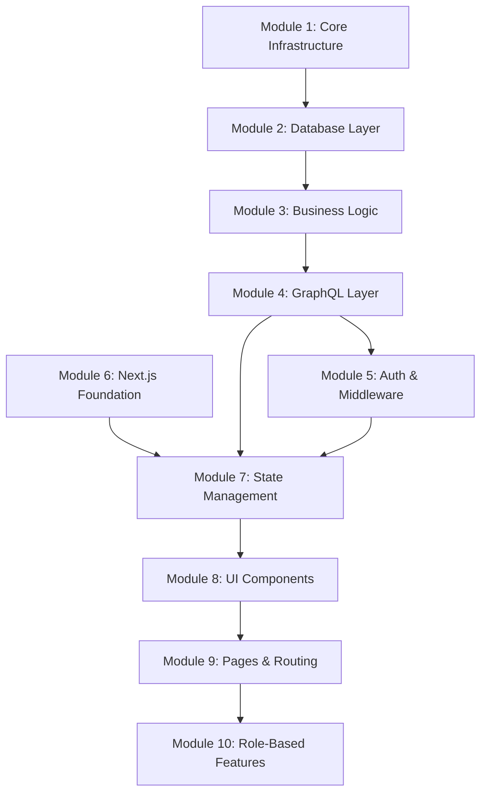

# Implementation Guide - Mini EdTech Learning Platform

## Modular Development Approach

This guide provides step-by-step implementation details following the modular architecture pattern from your backend structure.

## Module Breakdown

### Backend Modules

#### Module 1: Core Infrastructure

**Priority: HIGH - Foundation for everything**
**Estimated Time: 3-4 hours**

**Files to Create:**

```
server/
├── package.json
├── tsconfig.json
├── .env.example
├── src/
│   ├── main.ts
│   ├── server.ts
│   └── common/
│       ├── config.ts
│       ├── database.ts
│       ├── logger.ts
│       └── lib/
│           ├── catchAsync.ts
│           ├── errorHandler.ts
│           └── index.ts
```

**Implementation Order:**

1. Project initialization and dependencies
2. TypeScript configuration
3. Environment configuration
4. Database connection setup
5. Logging infrastructure
6. Error handling utilities

**Key Dependencies:**

```json
{
  "apollo-server-express": "^3.12.0",
  "express": "^4.18.2",
  "graphql": "^16.6.0",
  "@prisma/client": "^4.15.0",
  "prisma": "^4.15.0",
  "winston": "^3.8.2",
  "cors": "^2.8.5",
  "helmet": "^6.1.5",
  "dotenv": "^16.0.3"
}
```

#### Module 2: Database Layer (Prisma + DAOs)

**Priority: HIGH - Data foundation**
**Estimated Time: 2-3 hours**

**Files to Create:**

```
prisma/
├── schema.prisma
├── seed.ts
└── migrations/
src/daos/
├── BaseDAO.ts
├── CourseDAO.ts
├── UserDAO.ts
├── EnrollmentDAO.ts
└── index.ts
```

**Implementation Order:**

1. Prisma schema definition
2. Database migrations
3. Base DAO with common operations
4. Specific DAOs for each entity
5. Seed scripts for sample data

**Sample BaseDAO Pattern:**

```typescript
export abstract class BaseDAO<T> {
  protected prisma: PrismaClient;

  constructor() {
    this.prisma = new PrismaClient();
  }

  abstract findAll(): Promise<T[]>;
  abstract findById(id: string): Promise<T | null>;
  abstract create(data: any): Promise<T>;
  abstract update(id: string, data: any): Promise<T>;
  abstract delete(id: string): Promise<void>;
}
```

#### Module 3: Business Logic (Services)

**Priority: HIGH - Core business rules**
**Estimated Time: 2-3 hours**

**Files to Create:**

```
src/services/
├── CourseService.ts
├── UserService.ts
├── EnrollmentService.ts
└── index.ts
```

**Implementation Order:**

1. Course management service
2. User management service
3. Enrollment business logic
4. Cross-service validations

**Service Pattern Example:**

```typescript
export class CourseService {
  private courseDAO: CourseDAO;

  constructor() {
    this.courseDAO = new CourseDAO();
  }

  async getAllCourses(): Promise<Course[]> {
    return this.courseDAO.findAll();
  }

  async getCourseById(id: string): Promise<Course | null> {
    return this.courseDAO.findById(id);
  }

  async updateCourse(
    id: string,
    data: UpdateCourseInput,
    userId: string
  ): Promise<Course> {
    // Validate user has professor role for this course
    await this.validateProfessorAccess(id, userId);
    return this.courseDAO.update(id, data);
  }
}
```

#### Module 4: GraphQL Layer

**Priority: HIGH - API interface**
**Estimated Time: 3-4 hours**

**Files to Create:**

```
src/graphql/
├── schema.ts
├── typedefs/
│   ├── course.ts
│   ├── user.ts
│   ├── enrollment.ts
│   └── index.ts
└── resolvers/
    ├── courseResolvers.ts
    ├── userResolvers.ts
    ├── enrollmentResolvers.ts
    └── index.ts
```

**Implementation Order:**

1. Type definitions for all entities
2. Query resolvers
3. Mutation resolvers
4. Schema composition
5. Apollo Server integration

#### Module 5: Authentication & Middleware

**Priority: MEDIUM - Security layer**
**Estimated Time: 2 hours**

**Files to Create:**

```
src/common/middlewares/
├── auth.ts
├── errorHandler.ts
├── validation.ts
└── index.ts
```

**Implementation Order:**

1. Mock authentication middleware
2. Error handling middleware
3. Input validation
4. CORS and security headers

### Frontend Modules

#### Module 6: Next.js Foundation

**Priority: HIGH - Frontend foundation**
**Estimated Time: 2-3 hours**

**Files to Create:**

```
client/
├── package.json
├── tsconfig.json
├── next.config.js
├── tailwind.config.js
├── src/app/
│   ├── layout.tsx
│   ├── page.tsx
│   └── globals.css
└── src/lib/
    ├── graphql/
    │   ├── client.ts
    │   ├── queries.ts
    │   └── mutations.ts
    └── utils.ts
```

**Implementation Order:**

1. Next.js 13+ App Router setup
2. Tailwind CSS configuration
3. Apollo Client setup
4. Basic routing structure

#### Module 7: State Management (Context API)

**Priority: HIGH - State foundation**
**Estimated Time: 2 hours**

**Files to Create:**

```
src/context/
├── AuthContext.tsx
├── CourseContext.tsx
└── index.ts
src/hooks/
├── useAuth.ts
├── useCourses.ts
└── useEnrollment.ts
```

**Implementation Order:**

1. Auth context with local storage
2. Course context with GraphQL integration
3. Custom hooks for state access
4. Context providers setup

#### Module 8: UI Components

**Priority: MEDIUM - User interface**
**Estimated Time: 3-4 hours**

**Files to Create:**

```
src/components/
├── ui/
│   ├── Button.tsx
│   ├── Card.tsx
│   ├── Input.tsx
│   ├── Loading.tsx
│   └── ErrorBoundary.tsx
├── layout/
│   ├── Header.tsx
│   ├── Navigation.tsx
│   └── Footer.tsx
└── course/
    ├── CourseCard.tsx
    ├── CourseList.tsx
    ├── CourseDetails.tsx
    └── EditCourseForm.tsx
```

**Implementation Order:**

1. Base UI components (Button, Card, Input)
2. Layout components
3. Course-specific components
4. Loading and error states

#### Module 9: Pages & Routing

**Priority: HIGH - User interface**
**Estimated Time: 3-4 hours**

**Files to Create:**

```
src/app/
├── courses/
│   ├── page.tsx
│   └── [id]/
│       ├── page.tsx
│       └── edit/
│           └── page.tsx
├── enrollment/
│   └── confirmation/
│       └── page.tsx
└── login/
    └── page.tsx
```

**Implementation Order:**

1. Home page (course listing)
2. Course details page
3. Login page
4. Enrollment confirmation
5. Edit course page (professor only)

#### Module 10: Role-Based Features

**Priority: MEDIUM - Advanced functionality**
**Estimated Time: 2-3 hours**

**Files to Create:**

```
src/components/auth/
├── ProtectedRoute.tsx
├── RoleGuard.tsx
└── LoginForm.tsx
src/hooks/
├── useRoleAccess.ts
└── usePermissions.ts
```

**Implementation Order:**

1. Role validation logic
2. Protected route components
3. Permission-based UI rendering
4. Professor-only features

## Development Sequence

### Day 1: Backend Core (8 hours)

**Morning (4 hours):**

- Module 1: Core Infrastructure
- Module 2: Database Layer (Prisma setup + Basic DAOs)

**Afternoon (4 hours):**

- Module 2: Complete DAOs + Seed data
- Module 3: Business Logic (Services)

### Day 2: API + Frontend Foundation (8 hours)

**Morning (4 hours):**

- Module 4: GraphQL Layer (Queries + Mutations)
- Module 5: Authentication & Middleware

**Afternoon (4 hours):**

- Module 6: Next.js Foundation
- Module 7: State Management

### Day 3: Frontend Features + Polish (8 hours)

**Morning (4 hours):**

- Module 8: UI Components
- Module 9: Core Pages

**Afternoon (4 hours):**

- Module 10: Role-Based Features
- Testing, Bug fixes, Documentation

## Testing Strategy per Module

### Backend Testing

```bash
# Test GraphQL endpoints
npm run test:graphql

# Test database operations
npm run test:dao

# Test business logic
npm run test:services
```

### Frontend Testing

```bash
# Test components
npm run test:components

# Test context providers
npm run test:context

# Test hooks
npm run test:hooks
```

## Module Dependencies



## Critical Success Factors

1. **Start with solid foundation** - Modules 1-3 must be robust
2. **Test early and often** - Each module should be tested before moving to next
3. **Keep interfaces clean** - Well-defined contracts between modules
4. **Document as you go** - Each module should have clear documentation
5. **Regular commits** - Commit after each module completion

## Risk Mitigation per Module

| Module              | Risk                | Mitigation                                        |
| ------------------- | ------------------- | ------------------------------------------------- |
| Database Layer      | Complex relations   | Start with simple schema, iterate                 |
| GraphQL Layer       | Complex resolvers   | Implement queries first, then mutations           |
| State Management    | Context complexity  | Start with simple state, add complexity gradually |
| Role-Based Features | Authorization logic | Implement basic roles first, enhance later        |

This modular approach ensures each part can be developed, tested, and integrated independently while maintaining the overall architecture integrity.
